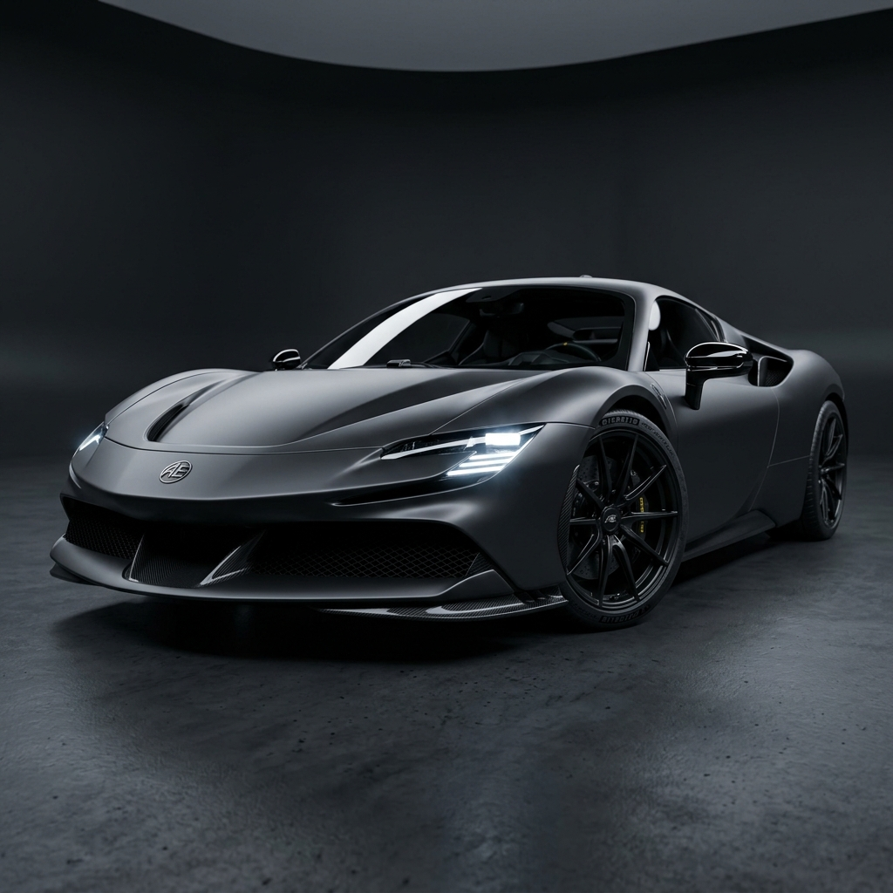

# 🏎️ NEXTCAR — Interactive Dynamics Dashboard

A high-performance, pixel-perfect interactive vehicle telemetry dashboard built as a frontend developer assessment. Converts a provided Figma design into a responsive, visually stunning web interface with full dark/light theme support.



---

## 🚀 Quick Start

### Prerequisites
- **Node.js** ≥ 18.x
- **npm** ≥ 9.x

### Installation & Running

```bash
# 1. Clone the repository
git clone https://github.com/<your-username>/teqmavens-assessment.git
cd teqmavens-assessment

# 2. Install dependencies
npm install

# 3. Start the development server
npm run dev

# 4. Open in browser
# Navigate to http://localhost:5173
```

### Build for Production

```bash
npm run build
npm run preview  # Preview the production build
```

---

## 🛠️ Tech Stack

| Technology | Version | Purpose |
|-----------|---------|---------|
| **React** | 19.x | UI framework with latest features |
| **TypeScript** | 6.x | Type safety and developer experience |
| **Vite** | 8.x | Build tool with HMR |
| **Tailwind CSS** | 4.x | Utility-first styling (v4 CSS-based config) |
| **Framer Motion** | 12.x | Animations and transitions |
| **Lucide React** | 1.x | Icon library |
| **React Bits** | — | Premium UI components (LightRays) |
| **OGL** | 1.x | WebGL library (required by LightRays) |
| **clsx + tailwind-merge** | — | Conditional class name merging |

---

## 🎨 Features

### Core
- ✅ **Pixel-perfect Figma match** — Dashboard view matches the provided design exactly
- ✅ **Dark & Light themes** — Toggle between themes with persistent localStorage storage
- ✅ **Mobile responsive** — Optimized for phones (320px+), tablets (768px+), and desktops (1024px+)
- ✅ **Smooth animations** — Animated counters, view transitions, hover effects, and particle system

### Design System
- **Fonts**: Orbitron (headings/mono) + Outfit (body/sans) via Google Fonts
- **Color theming**: CSS custom properties with dynamic accent color switching (Red, Cyan, Gold, Green)
- **Glassmorphism**: Glass panel and button effects with backdrop blur
- **Background**: WebGL LightRays (via React Bits), volumetric glowing rings, and floor shine lighting

### Dashboard
- Central car image with animated orbital rings and glow effects
- 6 telemetry metrics with animated number counters (comma-formatted)
- Interactive 5-lap timeline with SVG curve (desktop) / horizontal selector (mobile)
- Curved side navigation rails with tooltips (desktop) / bottom nav bar (mobile/tablet)
- Download, share, and diagnostics action buttons

### Additional Features (Beyond Figma)
- **Home View** — Landing page with animated "Ignite Engine" CTA
- **Settings View** — Drive mode selection (Comfort/Sport/Track/Drift) and accent color picker
- **Generic Modal System** — A highly reusable generic Modal engine utilized by all dialogs
- **Diagnostic Modal** — Simulated vehicle system health scan
- **Share Modal** — Share via WhatsApp, Telegram, Email, or native share API
- **Policy Modal** — Custom dialog for licensing and assessment protocols
- **Toast Notifications** — Beautifully animated framer-motion success toasts for completed actions
- **Accent Colors** — 4 customizable accent color themes

---

## 📐 Responsive Design Strategy

The Figma design targets a desktop viewport (~1440px). The responsive adaptation was designed creatively while preserving the core design language:

| Breakpoint | Width | Layout Adaptations |
|-----------|-------|-------------------|
| **xs** | < 640px | 2-col metric grid, 220px car circle, horizontal lap selector, bottom nav bar, stacked actions |
| **sm** | 640px+ | Larger car circle (280px), full SVG timeline, improved spacing |
| **md** | 768px+ | Tablet layout with more breathing room, larger typography |
| **lg** | 1024px+ | Desktop: curved side menus visible, bottom nav hidden, footer shown |
| **xl** | 1280px+ | Full Figma-matching layout with max-width container |

### Mobile Navigation
On screens below `lg` (1024px), the curved side navigation rails are replaced with a **bottom navigation bar** featuring the same glassmorphism design language, brand-colored active indicators, and smooth layout animations.

---

## 🏗️ Project Structure

```
src/
├── components/
│   ├── AnimatedCounter.tsx    # Animated number transitions with locale formatting
│   ├── AppHeader.tsx          # Logo + theme toggle header
│   ├── BackgroundEffects.tsx  # Canvas particles + decorative circles
│   ├── CurvedMenu.tsx         # Desktop curved side navigation rails
│   ├── DashboardActions.tsx   # Download/Share/Diagnostics buttons
│   ├── DashboardView.tsx      # Main dashboard with metrics + car image
│   ├── DiagnosticModal.tsx    # Vehicle diagnostic scan modal
│   ├── HomeView.tsx           # Landing page with Ignite CTA
│   ├── LapsTimeline.tsx       # SVG lap timeline (desktop) + mobile selector
│   ├── LightRays.tsx          # WebGL light ray background (React Bits)
│   ├── Logo.tsx               # Responsive NEXTCAR logo
│   ├── MobileNav.tsx          # Bottom navigation for mobile/tablet
│   ├── Modal.tsx              # Generic reusable glassmorphic modal base
│   ├── PolicyModal.tsx        # Licensing and assessment protocol dialog
│   ├── SettingsView.tsx       # Drive mode + accent color settings
│   ├── ShareModal.tsx         # Share via multiple channels
│   └── Toast.tsx              # Custom success notification component
├── hooks/
│   ├── useDocumentAppearance.ts  # Theme + accent color sync to DOM
│   └── useDownloadIndicator.ts   # Download state machine simulation
├── lib/
│   ├── constants.ts           # Lap data, drive modes, accent colors
│   ├── telemetry.ts           # Metric calculation with drive mode multipliers
│   ├── types.ts               # TypeScript interfaces and types
│   └── utils.ts               # cn() class merging utility
├── assets/                    # Images (car photo, logo, hero)
├── App.tsx                    # Root component with state management
├── main.tsx                   # Entry point with StrictMode
└── index.css                  # Tailwind v4 theme config + custom utilities
```

---

## 💡 Assumptions & Design Decisions

1. **Figma Values as Source of Truth**: The dashboard metric values (352, 620, 780, 3.2 Sec, 2,450 KM, 520 KM) were taken directly from the Figma screenshot for LAP 03. The default "Track" drive mode uses 1.0x multipliers so raw values display exactly as designed.

2. **Mobile Navigation Pattern**: Since the Figma only shows a desktop layout, I chose a **bottom navigation bar** for mobile/tablet — a familiar pattern from automotive apps that maintains the dark, premium feel.

3. **Extra Views as Skill Demonstration**: HomeView and SettingsView go beyond the Figma but demonstrate component architecture, state management, and theme flexibility. The dashboard view remains the primary focus.

4. **Tailwind CSS v4**: Using the latest Tailwind v4 with CSS-based configuration (`@theme` directive) instead of a traditional `tailwind.config.js`. This is the recommended v4 approach.

5. **Theme Persistence**: Theme and accent color selections are persisted to `localStorage` so user preferences survive page reloads.

6. **No External UI Libraries**: All components are hand-crafted to demonstrate frontend skills rather than relying on component libraries like shadcn/ui or Material UI.

---

## 📄 License

This project was created as a frontend developer assessment for TEQMAVENS.
